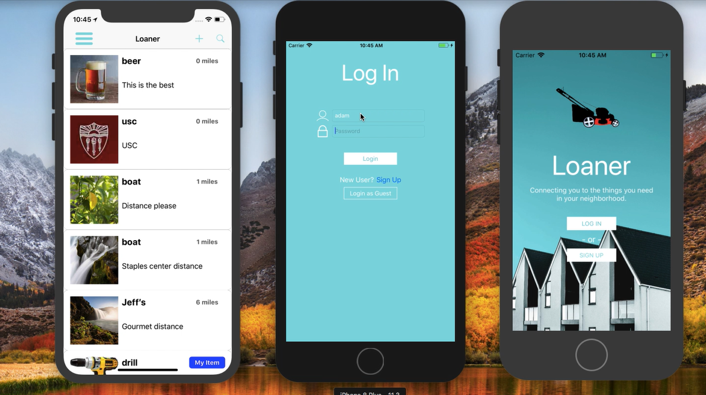

# Loaner

### Checkout the full demo of the prototype here: https://www.youtube.com/watch?v=rijSqBegmjE

Connecting you to the things you need in your neighborhood. Like a free and for sale community except for borrowing.

Need a camera but don’t want to buy or rent one?
Loaner helps you find friends and neighbors that you can borrow from. Give back to the community and post your own things you don’t use often collecting dust in your garage.

## Libraries
- [Cloudinary](https://cloudinary.com)
- [Starscream](https://github.com/daltoniam/starscream)
- [SendBird](https://sendbird.com)
- [Alamofire](https://github.com/Alamofire/Alamofire)
- [Google Maps](https://developers.google.com/maps/documentation/ios-sdk/intro)
- [Google Places](https://developers.google.com/places/ios-sdk/intro)

## Contributors
Developed by a team at USC
- AG Liber
- Daniyal Javed
- Avni Barman
- Anup Sankarraman
- Tristan Caparas.
